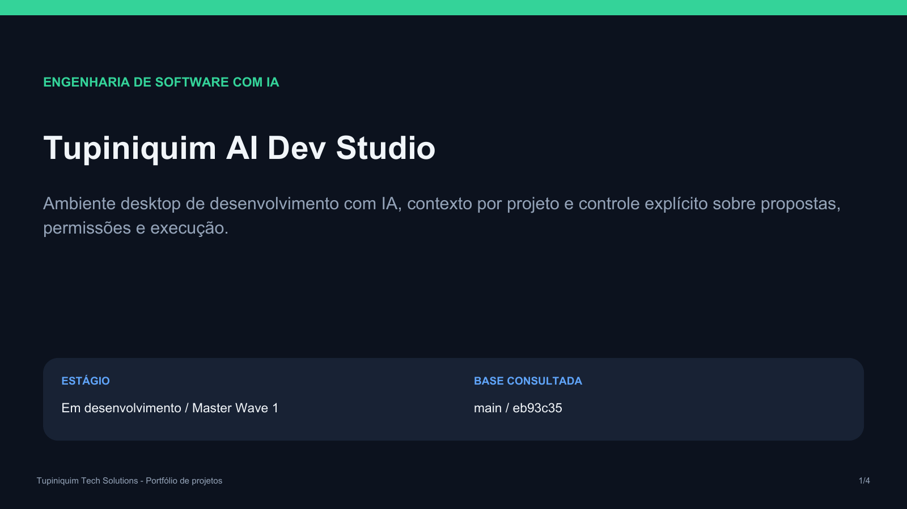
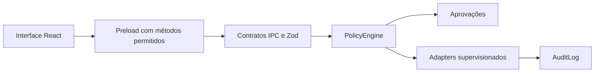

<p align="center">
  <a href="docs/APRESENTACAO_PROJETO.pdf"></a>
</p>

# Tupiniquim AI Dev Studio

**Engenharia de software com IA, contexto por projeto e controle sobre a execução.**

O Tupiniquim AI Dev Studio é uma plataforma desktop local-first em desenvolvimento. Reúne sessões de trabalho, provedores de IA e propostas de alteração em uma arquitetura com isolamento de workspace, validação de permissões e auditoria.

**[Abrir apresentação em PDF](docs/APRESENTACAO_PROJETO.pdf)** · [Arquitetura](.agent/ARCHITECTURE.md) · [Estado do projeto](.agent/STATUS.md) · [Plano mestre](.agent/MASTER_PLAN.md)

## O que o projeto entrega

| Capacidade | Aplicação no trabalho |
| --- | --- |
| Sessão Tupiniquim por workspace | Organiza a conversa e mantém os projetos separados. |
| Continuidade entre provedores | Compartilha contexto público da sessão sem reutilizar threads de outro provedor. |
| Propostas com origem identificada | Vincula a proposta ao provedor e ao contexto que a produziram. |
| Políticas e aprovações | Submete operações privilegiadas a regras de escopo, permissão e validade. |
| Contratos tipados e auditoria | Valida mensagens entre componentes e registra resultados sanitizados. |

O usuário escolhe modelo e provedor. Agentes, modelos, provedores, ferramentas e skills têm papéis distintos na arquitetura.

## Estágio atual

**Em desenvolvimento: Master Wave 1.** A documentação publicada em 06/09/2026 registra a continuidade de conversa do checkpoint wave-15 e aponta recuperação de sessão após reinício como a próxima unidade de trabalho.

| Área | Situação registrada |
| --- | --- |
| Fundação Electron, contratos e políticas | Implementada na base do projeto. |
| Sessões por workspace e continuidade entre provedores | Implementadas no serviço de sessões. |
| Recuperação completa da sessão após reinício | Pendente no plano vigente. |
| Terminal e Git com operações de alteração | Indisponíveis no status publicado. |
| Pesquisa, RAG, estúdio completo e multimodal | Evolução prevista no plano mestre. |

O registro de agentes especializados é um catálogo de capacidades e referências. Sua presença não significa que todas estejam disponíveis no produto.

## Arquitetura



A interface Electron permanece isolada das capacidades privilegiadas. O processo principal controla adapters e políticas. A persistência usa SQLite em worker dedicado, enquanto o serviço de sessões mantém estado de conversa cuja recuperação completa ainda está em evolução.

| Camada | Tecnologias |
| --- | --- |
| Aplicação desktop | Electron, React e TypeScript |
| Contratos e estado | Zod e XState |
| Editor | Monaco Editor |
| Persistência | SQLite em worker |
| Build e qualidade | electron-vite, ESLint, Vitest e Playwright |

## Desenvolvimento

O ambiente operacional documentado usa Windows e `F:\CODEX\Tupiniquim-AI-Dev-Studio`. O projeto exige Node.js 24 ou superior e declara pnpm 11.16.0. Leia [AGENTS.md](AGENTS.md) antes de configurar o ambiente.

```powershell
powershell -NoProfile -ExecutionPolicy Bypass -File .\scripts\bootstrap-f.ps1
pnpm dev
```

Os comandos de validação e empacotamento constam no [package.json](package.json):

```powershell
pnpm validate
pnpm test:e2e
pnpm test:dogfood
pnpm package:win
```

## Qualidade e segurança

O [relatório de 06/09/2026](https://github.com/tupiniquimtechsolution-blip/Tupiniquim_AI_Dev_Studio/blob/eb93c352127d3b6263d1f2abf485ff31b390292a/.agent/STATUS.md) registra 82 testes unitários aprovados, 49 de integração aprovados e 2 ignorados, 34 de segurança aprovados e 3 E2E aprovados. São evidências históricas do runtime indicado no relatório, não uma nova execução nem uma garantia sobre qualquer revisão posterior.

As fronteiras incluem renderer isolado, preload mínimo, validação de IPC, escopo de workspace, aprovação de alterações e sanitização de logs. Consulte a [política de segurança](.agent/SECURITY.md).

## Evolução prevista

1. Recuperação da memória e da sessão após reinício.
2. Pesquisa, conhecimento e registros de ferramentas e skills.
3. Consolidação do estúdio e validação de uso real.
4. Agentes especializados e capacidades multimodais conforme os gates do projeto.

## Apresentação e fontes

A [apresentação do projeto](docs/APRESENTACAO_PROJETO.pdf) reúne proposta, capacidades, arquitetura e estágio em quatro páginas, seguindo a identidade visual do portfólio MetalArt.

Conteúdo consultado em **30/09/2026**, com base na revisão [`eb93c35`](https://github.com/tupiniquimtechsolution-blip/Tupiniquim_AI_Dev_Studio/tree/eb93c352127d3b6263d1f2abf485ff31b390292a). Fontes principais: [status](.agent/STATUS.md), [plano mestre](.agent/MASTER_PLAN.md), [arquitetura](.agent/ARCHITECTURE.md) e [serviço de sessões](packages/core/src/tupiniquim-session.ts).

**Tupiniquim Tech Solutions**
